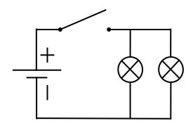
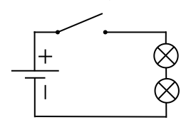

# Parallelschaltung und Reihenschaltung
## Grundlagen der Elektrizität
### Präsentiert von Hanke Jakob & Lehmann Janneck

---

# Inhaltsverzeichnis
1. Einführung
2. Parallelschaltung
   - Definition
   - Charakteristische Eigenschaften
   - Anwendungsbeispiele
3. Reihenschaltung
   - Definition
   - Charakteristische Eigenschaften
   - Anwendungsbeispiele
4. Vergleich: Parallelschaltung vs. Reihenschaltung
5. Zusammenfassung

---

# Einführung
- Grundkonzepte der Schaltungen
- Bedeutung der Schaltungen in der Alltagstechnik

---

# Parallelschaltung
## Definition
 <!-- Beispielbild -->
- Alle Komponenten parallel zueinander
- Gleiches Potential (Spannung) an allen Punkten

---

## Charakteristische Eigenschaften
- Gesamtstrom = Summe der Teilströme
- Gesamtwiderstand niedriger als der kleinste Einzelwiderstand

---

## Anwendungsbeispiele
- Haushaltselektrik (Steckdosen)
- Computernetzwerke

---

# Reihenschaltung
## Definition
 <!-- Beispielbild -->
- Komponenten hintereinander geschaltet
- Gleicher Strom fließt durch jede Komponente

---

## Charakteristische Eigenschaften
- Gesamtspannung = Summe der Teilspannungen
- Gesamtwiderstand = Summe aller Widerstände

---

## Anwendungsbeispiele
- Weihnachtsbeleuchtung
- Batterieschaltungen

---

# Vergleich: Parallelschaltung vs. Reihenschaltung
- Spannung und Stromverteilung
- Einfluss auf den Gesamtwiderstand
- Verhalten bei Defekt einer Komponente

---

# Zusammenfassung
- Wiederholung der Schlüsseleigenschaften
- Bedeutung im praktischen Einsatz

---

# Dankeschön!
## Fragen?
### [Ihr Name] & [Name des Co-Präsentators]

---

# Quellen

## Bildquellen
- Reihenschaltung Bild: [denkwerkstatt-physik.de](https://denkwerkstatt-physik.de/denkwerkstatt-physik/awk/w_reihenschaltung.html)
- Parallelschaltung Bild: [denkwerkstatt-physik.de](https://denkwerkstatt-physik.de/denkwerkstatt-physik/awk/w_parallelschaltung.html)  

## Inhaltsquellen
- [Wikipedia - Reihenschaltung](https://de.wikipedia.org/wiki/Reihenschaltung)
- [Studyflix - Reihen- und Parallelschaltung](https://studyflix.de/elektrotechnik/reihen-und-parallelschaltung-260)
- [Wikipedia - Parallelschaltung](https://de.wikipedia.org/wiki/Parallelschaltung)

Letzter Zugriff: 13. Mai 2024